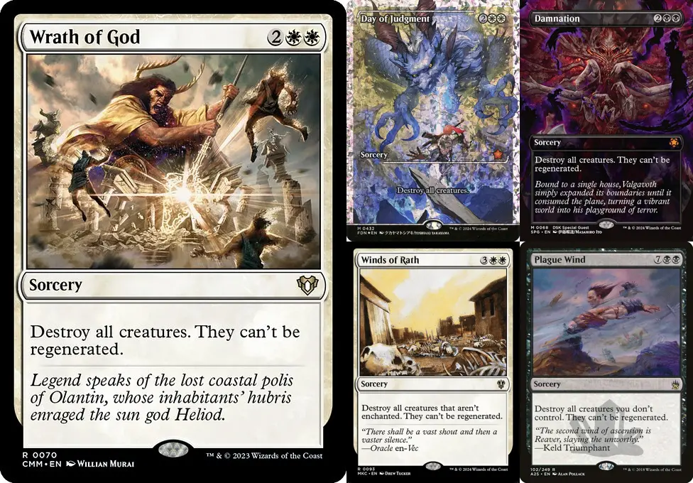

# mtg-embeddings



Code used to create text embeddings of all Magic: The Gathering card until Aetherdrift (2025-02-14). The text embeddings are centered around card mechanics (i.e. no flavor text/card art embeddings) in order to identify similar cards mathematically.

These embeddings can be downloaded from [Hugging Face datasets](https://huggingface.co/datasets/minimaxir/mtg-embeddings), specifically the `mtg-embeddings.parquet` file [here](https://huggingface.co/datasets/minimaxir/mtg-embeddings/tree/main).

Relevant notebooks:

- [mtgjson_etl.ipynb](mtgjson_etl.ipynb): Python code for preprocessing the Magic card data.
- [mtg_embeddings_gen.ipynb](mtg_embeddings_gen.ipynb): Python code run on a cloud VM w/ GPU to batch-create the embeddings.
- [mtg_embeddings_umap_to_2D.ipynb](mtg_embeddings_umap_to_2D.ipynb): Python code run on a cloud VM w/ GPU to reduce the dimensionality of the embeddings from 768D to 2D for data visualization.
- [mtg_2d_data_viz.Rmd](mtg_2d_data_viz.Rmd): R code to create the UMAP data visualization.
- [mtg_related_card_img.ipynb](mtg_related_card_img.ipynb): Python code to test related card compositing into a single image.

Other notebooks contain miscellaneous testing used for the blog post.

## How The Embeddings Were Created

Using the data exports from [MTGJSON](https://mtgjson.com), the data was deduped by card name to the most recent card printing and aggregated as a prettified JSON object string (including indentation, which is relevant to embedding quality).

An example card input string:

```txt
{
  "name": "Marhault Elsdragon",
  "manaCost": "{3}{R}{R}{G}",
  "type": "Legendary Creature — Elf Warrior",
  "text": "Rampage 1 (Whenever this creature becomes blocked, it gets +1/+1 until end of turn for each creature blocking it beyond the first.)",
  "power": "4",
  "toughness": "6",
  "rarities": [
    "uncommon"
  ],
  "sets": [
    "LEG",
    "BCHR",
    "CHR",
    "ME3"
  ]
}
```

This JSON string was then encoded and unit-normalized using the [Alibaba-NLP/gte-modernbert-base](https://huggingface.co/Alibaba-NLP/gte-modernbert-base) text embedding model.

JSON schema definitions:

- `name`: Card name
- `manaCost`: Card mana cost
- `type`: Card type (full textline)
- `text`: Gatherer card text. Exact matches to card names within card text are replaced with `~` for consistency.
- `power`: Card power. Omitted if N/A.
- `toughness`: Card toughness. Omitted if N/A.
- `loyalty`: Card loyalty. Omitted if N/A.
- `rarities`: List of all card rarities for all printings of the card. Rarities are listed in this order: `["common", "uncommon", "rare", "mythic", "bonus", "special"]`
- `sets`: List of all sets the card was printed in. Sets are listed in chronological order of printing. Basic lands have a special case of `[*]`.

It took 1:17 to encode all ~33k cards using a preemptible L4 GPU on Google Cloud Platform (`g2-standard-4`) at ~$0.28/hour, costing < $0.01 overall.

## Maintainer/Creator

Max Woolf ([@minimaxir](https://minimaxir.com))

_Max's open-source projects are supported by his [Patreon](https://www.patreon.com/minimaxir) and [GitHub Sponsors](https://github.com/sponsors/minimaxir). If you found this project helpful, any monetary contributions to the Patreon are appreciated and will be put to good creative use._

## License

MIT
